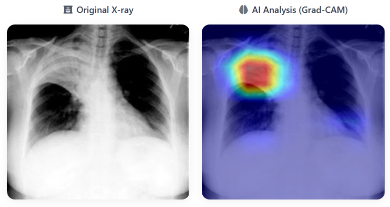
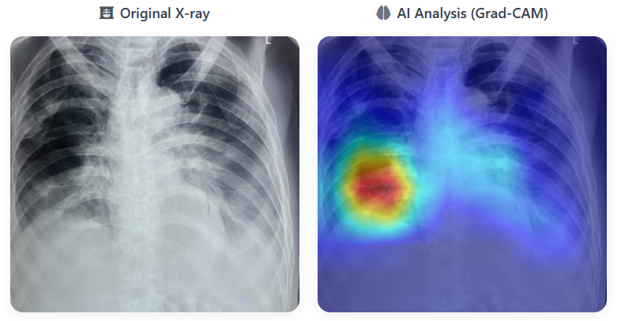
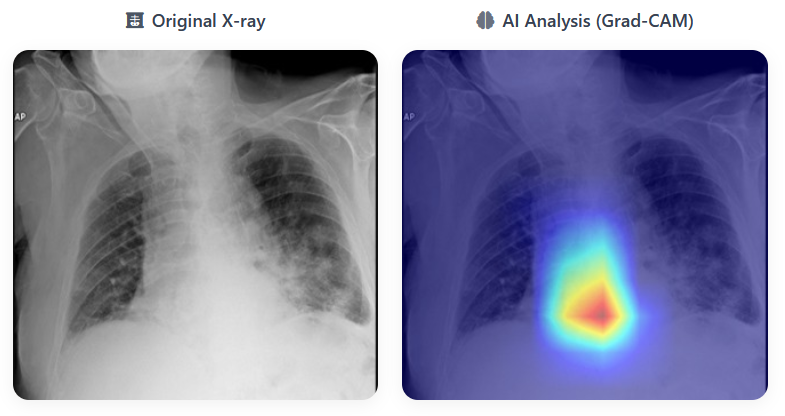
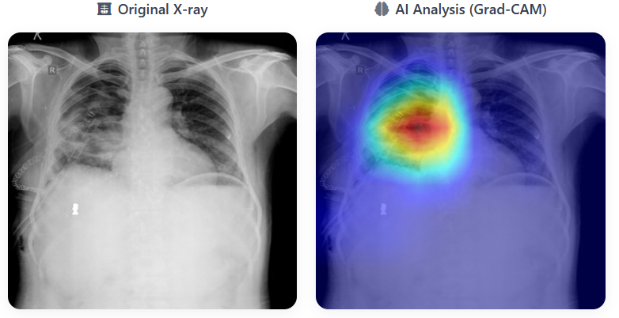

# 🩻 InsightX – AI-Powered Chest X-ray Screening for Rural Healthcare

## 🚀 Overview

**InsightX** is a hackathon prototype medical imaging platform designed to assist healthcare workers in rural clinics with early detection of thoracic diseases like **lung cancer** using **deep learning** and **Grad-CAM** visualizations.

- 📤 Upload a chest X-ray → 💡 Get AI predictions + heatmaps
- 📝 Generates a bilingual (English + Nepali) PDF screening report
- ⚙️ Runs offline (as `.exe`) or hosted via Flask
- 🌐 Built for **low-resource rural clinics** with a focus on **Nepal**

---

## 📚 Table of Contents

- [Features](#️️-features)
- [Tech Stack](#️-tech-stack)
- [Project Structure](#-project-structure)
- [Installation](#-installation)
  - [Easiest Setup (Windows)](#easiest-setup-windows)
  - [Run via Python (Dev Mode)](#run-via-python-dev-mode)
- [Sample Output](#-sample-output)
- [Impact](#-impact)
- [Disclaimer](#️-disclaimer)
- [Contributing](#-contributing)
- [License](#-license)
- [Team Members](#-team-members)

---

## ⚙️ Features

- 🖼️ Upload chest X-ray images (`.jpg`, `.png`)
- 🧠 AI inference using **EfficientNet + CBAM**
- 🔥 Grad-CAM heatmap overlays for explainability
- 📄 Auto-generated **clinician-style PDF reports** (monospace font)
- 🌐 Bilingual output: **English + Nepali**
- 💻 Launch via **standalone `.exe`** or Flask app

---

## 🛠️ Tech Stack

- **Frontend**: HTML, CSS, JavaScript (Flask Templates)
- **Backend**: Flask, Python
- **ML**: PyTorch, Torchvision, EfficientNet-B0 + CBAM, Grad-CAM
- **PDF Generation**: ReportLab
- **Deployment**: PyInstaller (`InsightX.exe`)

---

## 📂 Project Structure

```
├── app.py                  # Flask app entry point
├── model_chestray.py       # Deep learning model
├── report_builder.py       # PDF + summary generation
├── preprocess.py           # Image preprocessing
├── post_process.py         # Inference postprocessing
├── templates/              # HTML templates
├── static/                 # JS, CSS, assets
├── outputs/                # Model weights
├── dist/InsightX.exe       # Standalone app (Windows)
├── validation_data/
│   ├── india/              # Sample Indian X-rays
│   ├── Nepal/              # Sample Nepali X-rays
│   └── low_quality/        # Noisy/low-res scans
└── requirements.txt
```

---

## 💻 Installation

### Easiest Setup (Windows) THIS MIGHT NOT WORK!! PLEASE USE THE MANUAL (PIP INSTALL -R REQUIREMENTS.TXT) --> PYTHON APP.PY AND MOVE TO NO.5

1. **Clone or download** this repository:

   ```bash
   git clone https://github.com/Team-8848-arc-Hackathon/AI-Medical-Imaging-Project.git
   ```

2. Navigate to the `dist/` folder.

3. **Double-click `InsightX.exe`** to launch the app.

4. Your browser will auto-open at: [http://127.0.0.1:5000](http://127.0.0.1:5000)

5. Upload any sample X-ray from:

   - `validation_data/india/`
   - `validation_data/Nepal/`
   - `validation_data/low_quality/`

> No Python or pip required!

---

### Run via Python (Dev Mode)

1. Install dependencies:

   ```bash
   pip install -r requirements.txt
   ```

2. Run the Flask app:

   ```bash
   python app.py
   ```

3. Open [http://127.0.0.1:5000](http://127.0.0.1:5000) in your browser.

---

## 📊 Sample Output

  
  
  
  


---

## 🌍 Impact

- Enables **early detection** in rural and remote areas
- Operates on **low-power hardware** (e.g., Raspberry Pi)
- Can be **extended to detect other thoracic diseases**
- Encourages **digital record-keeping** in low-resource clinics

---

## ⚠️ Disclaimer

> ⚠️ This is a hackathon prototype for **demonstration purposes only**.  
> Not intended for real-world clinical use without proper validation, approvals, and certification.

---

## 🤝 Contributing

We welcome contributions! If you'd like to improve InsightX, please submit a Pull Request.

---

## 📄 License

This project is licensed under the **MIT License**.  
See the [`LICENSE`](LICENSE) file for full details.

---

## 👥 Team Members
## 8848.arc
 

> _Names listed alphabetically (except team lead); contribution levels may vary._

| Name              | Role                          | GitHub                  |
|-------------------|-------------------------------|--------------------------|
| **Rishav Mishra** | Team Lead, ML Modeling        | [@tokito-99](https://github.com/tokito-99) |
| Aayusha Pokharel  | Front-end                     | [@ap4678](https://github.com/ap4678) |
| Bivan Prajapati   | Front-end                     | [@BivanPrajapati](https://github.com/BivanPrajapati) |
| Menuka Ghalan     | Back-end, Front-end, Data Processing | [@menukaghalan](https://github.com/menukaghalan) |
| Seema Gupta       | Back-end                      | [@gupta-seema](https://github.com/gupta-seema) |

---

> _Built with ❤️ for rural healthcare accessibility_